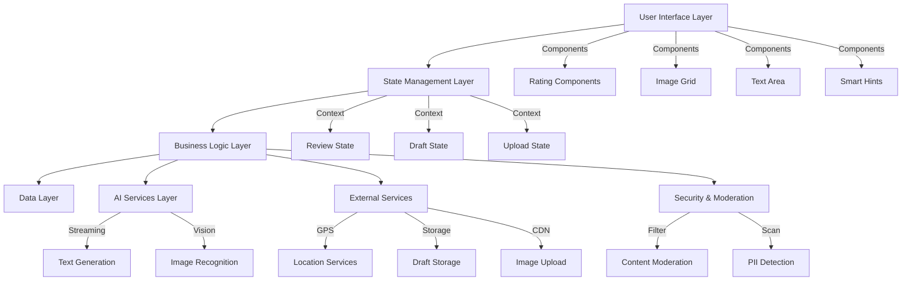
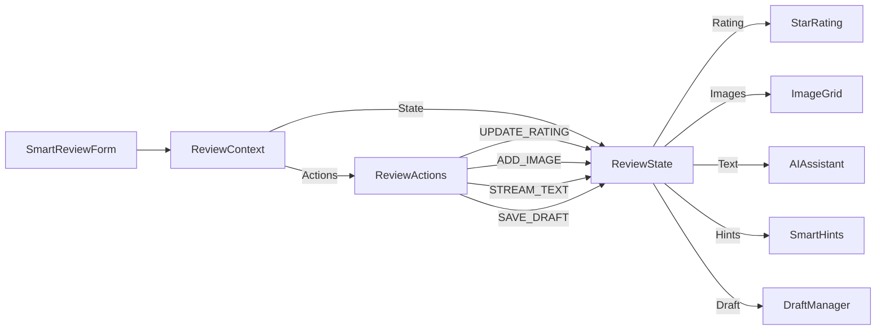

# Design Document: SmartReview System

## Overview

The SmartReview system is a comprehensive review publishing platform that combines modern UI design with AI-powered features. The system follows a component-based architecture with React/TypeScript, integrating Gemini AI for writing assistance and implementing advanced features like image recognition, location verification, and intelligent suggestions.

## Architecture

### High-Level Architecture



### State Management Architecture

The system uses React Context with useReducer for centralized state management to handle complex cross-component interactions:



### Component Architecture

The system follows a modular component structure within the existing reviews feature directory:

- **Pages**: WriteReviewPage (main interface)
- **Components**: Reusable UI components for ratings, image upload, hints
- **Contexts**: State management contexts for review, draft, and upload states
- **Hooks**: Custom hooks for AI integration, draft management, location
- **Utils**: Helper functions for validation, formatting, API calls, compression
- **Types**: TypeScript interfaces for type safety
- **Services**: AI streaming, content moderation, image processing services

## Components and Interfaces

### Core Components

#### 1. SmartReviewForm
Main container component that orchestrates all review creation functionality with centralized state management.

```typescript
interface SmartReviewFormProps {
  merchantId: string;
  merchantName: string;
  merchantCategory: BusinessCategory;
  onSubmit: (review: ReviewData) => Promise<void>;
  onCancel: () => void;
}

// State Management Context
interface ReviewContextState {
  reviewData: Partial<ReviewData>;
  draftState: DraftState;
  uploadState: UploadState;
  aiState: AIStreamingState;
  validationErrors: ValidationErrors;
  isSubmitting: boolean;
}

interface ReviewContextActions {
  updateRating: (rating: number) => void;
  updateText: (text: string) => void;
  addImage: (image: File) => void;
  removeImage: (imageId: string) => void;
  streamAIText: (prompt: string) => void;
  saveDraft: () => void;
  loadDraft: (draftId: string) => void;
  validateForm: () => void;
}
```

#### 2. StarRatingComponent
Advanced rating component supporting 0.5 increments with visual feedback.

```typescript
interface StarRatingProps {
  value: number;
  onChange: (rating: number) => void;
  size?: 'small' | 'medium' | 'large';
  readonly?: boolean;
  showText?: boolean;
}
```

#### 3. ImageUploadGrid
3x3 grid for image/video uploads with drag-and-drop support and client-side compression.

```typescript
interface ImageUploadGridProps {
  images: UploadedImage[];
  onImagesChange: (images: UploadedImage[]) => void;
  maxImages?: number;
  onImageAnalysis?: (image: UploadedImage, tags: string[]) => void;
  compressionOptions?: CompressionOptions;
}

interface CompressionOptions {
  maxWidth: number;
  maxHeight: number;
  quality: number; // 0.1 - 1.0
  maxSizeKB: number;
}
```

#### 4. AIWritingAssistant // Mark this todo, do not implement 
Gemini-powered writing assistance component with streaming support.

```typescript
interface AIWritingAssistantProps {
  rating: number;
  images: UploadedImage[];
  currentText: string;
  onTextStreaming: (chunk: string, isComplete: boolean) => void;
  onStreamError: (error: Error) => void;
  merchantCategory: BusinessCategory;
  streamingState: AIStreamingState;
}

interface AIStreamingState {
  isStreaming: boolean;
  currentChunk: string;
  accumulatedText: string;
  error: string | null;
  progress: number; // 0-100
}
```

#### 5. SmartHintsPanel// mark this todo do not implment it 
Context-aware suggestion tags based on ratings with character count integration.

```typescript
interface SmartHintsPanelProps {
  rating: number;
  category: BusinessCategory;
  onHintSelected: (hint: string) => void;
  currentText: string;
  characterCount: number;
  maxCharacters: number;
  showPointsIncentive: boolean;
}
```

## Data Models

### Core Data Structures

```typescript
interface ReviewData {
  id: string;
  merchantId: string;
  userId: string;
  overallRating: number;
  detailedRatings: {
    quality: number;
    environment: number;
    service: number;
  };
  reviewText: string;
  images: UploadedImage[];
  priceInfo: {
    amount: number;
    currency: string;
    type: 'per_person' | 'per_night' | 'total';
  };
  visitDate: Date;
  isAnonymous: boolean;
  syncToFeed: boolean;
  locationVerified: boolean;
  aiAssisted: boolean;
  tags: string[];
  createdAt: Date;
  updatedAt: Date;
  // Security & Moderation
  moderationStatus: ModerationStatus;
  contentFlags: ContentFlag[];
  characterCount: number;
  pointsEarned?: number; // For 20+ character incentive
}

interface UploadedImage {
  id: string;
  file: File;
  url: string;
  thumbnail: string;
  type: 'image' | 'video';
  // Enhanced upload state management
  uploadState: UploadState;
  compressionRatio?: number;
  originalSize: number;
  compressedSize: number;
  uploadProgress: number; // 0-100
  analysisResults?: ImageAnalysis;
  suggestedTags?: string[];
  // Security scanning
  piiDetected?: boolean;
  piiWarnings?: string[];
}

interface UploadState {
  status: 'pending' | 'compressing' | 'uploading' | 'analyzing' | 'complete' | 'error';
  progress: number;
  error?: string;
  retryCount: number;
}

interface ImageAnalysis {
  category: 'menu' | 'storefront' | 'food' | 'interior' | 'receipt' | 'other';
  confidence: number;
  detectedObjects: string[];
  suggestedHashtags: string[];
  // PII Detection
  containsPII: boolean;
  piiTypes: ('phone' | 'email' | 'address' | 'id_number')[];
  piiConfidence: number;
}

interface DraftData extends Partial<ReviewData> {
  draftId: string;
  lastSaved: Date;
  merchantInfo: {
    id: string;
    name: string;
    category: BusinessCategory;
  };
  // Enhanced draft state
  autoSaveEnabled: boolean;
  syncStatus: 'local' | 'syncing' | 'synced' | 'conflict';
  version: number;
}

// Security & Moderation Models
interface ModerationStatus {
  status: 'pending' | 'approved' | 'flagged' | 'rejected';
  reviewedAt?: Date;
  reviewedBy?: 'ai' | 'human';
  flags: ContentFlag[];
}

interface ContentFlag {
  type: 'inappropriate' | 'spam' | 'fake' | 'pii' | 'sensitive';
  confidence: number;
  description: string;
  autoGenerated: boolean;
}

// Character Count & Incentive
interface TextValidation {
  characterCount: number;
  wordCount: number;
  isMinimumMet: boolean; // 15 characters minimum
  isIncentiveEligible: boolean; // 20+ characters for points
  maxCharactersReached: boolean; // 200 character limit
  pointsToEarn: number;
}
```
```

### Business Logic Models

```typescript
enum BusinessCategory {
  RESTAURANT = 'restaurant',
  HOTEL = 'hotel',
  RETAIL = 'retail',
  SERVICE = 'service',
  ENTERTAINMENT = 'entertainment'
}

interface SmartHint {
  id: string;
  text: string;
  category: 'positive' | 'negative' | 'neutral';
  ratingRange: [number, number];
  businessCategories: BusinessCategory[];
  hashtag: string;
  // Character count integration
  characterContribution: number;
  pointsValue: number;
}

interface LocationVerification {
  isVerified: boolean;
  accuracy: number;
  timestamp: Date;
  coordinates: {
    latitude: number;
    longitude: number;
  };
}

// AI Streaming Models
interface AIStreamingRequest {
  prompt: string;
  context: {
    rating: number;
    category: BusinessCategory;
    images: string[]; // Image analysis results
    currentText: string;
  };
  streamingOptions: {
    maxTokens: number;
    temperature: number;
    stopSequences: string[];
  };
}

interface AIStreamingResponse {
  chunk: string;
  isComplete: boolean;
  totalTokens?: number;
  finishReason?: 'stop' | 'length' | 'content_filter';
  error?: string;
}

// Content Moderation Models
interface ModerationRequest {
  text: string;
  images?: string[];
  userId: string;
  merchantId: string;
}

interface ModerationResponse {
  approved: boolean;
  flags: ContentFlag[];
  suggestedEdits?: string[];
  severity: 'low' | 'medium' | 'high';
  requiresHumanReview: boolean;
}

// Image Compression Models
interface CompressionResult {
  originalFile: File;
  compressedFile: File;
  originalSize: number;
  compressedSize: number;
  compressionRatio: number;
  quality: number;
  dimensions: {
    original: { width: number; height: number };
    compressed: { width: number; height: number };
  };
}
```

## Correctness Properties

*A property is a characteristic or behavior that should hold true across all valid executions of a system-essentially, a formal statement about what the system should do. Properties serve as the bridge between human-readable specifications and machine-verifiable correctness guarantees.*

### Property 1: Form Validation State Consistency
*For any* review form state, the publish button should be disabled when required fields are missing and enabled when all required fields are complete
**Validates: Requirements 1.2, 1.3**

### Property 2: Rating Component Precision
*For any* star rating interaction, the component should support 0.5 increments and provide appropriate visual feedback with correct colors
**Validates: Requirements 2.1, 2.2**

### Property 3: Dynamic Rating Text Feedback
*For any* rating value from 0.5 to 5.0, the system should display appropriate text feedback that corresponds to the rating level
**Validates: Requirements 2.3**

### Property 4: Image Upload Capacity Management
*For any* image upload operation, the system should enforce the maximum limit of 9 images and display appropriate UI states
**Validates: Requirements 3.1, 3.3**

### Property 5: Smart Hints Rating Correlation
*For any* overall rating change, the smart hints panel should update to display contextually appropriate suggestion tags
**Validates: Requirements 5.1, 5.2, 5.4**

### Property 6: Hint Tag Text Integration
*For any* hint tag selection, the tag text should be properly appended to the review input field with correct hashtag formatting
**Validates: Requirements 5.3, 5.5**

### Property 7: Character Count Validation with Limits
*For any* text input in the review field, the system should accurately count characters, enforce the minimum 15-character requirement, maximum 200-character limit, and display points incentive for 20+ characters
**Validates: Requirements 6.3, 6.4**

### Property 8: Business Category Price Adaptation
*For any* business category selection, the price input field should display the appropriate label and validation rules
**Validates: Requirements 7.1**

### Property 9: Form Data Persistence
*For any* review form data including ratings, text, images, and settings, all data should be properly saved and retrievable
**Validates: Requirements 7.5, 9.4**

### Property 10: Draft Auto-Save Functionality
*For any* review creation session, draft data should be automatically saved and restorable upon return
**Validates: Requirements 9.1, 9.2, 9.3**

### Property 11: Image Compression Consistency
*For any* uploaded image, the compression process should maintain visual quality while reducing file size within acceptable limits
**Validates: Requirements 3.2, 3.4**

### Property 12: AI Streaming Text Generation
*For any* AI text generation request, the streaming response should be properly handled with progress tracking and error recovery
**Validates: Requirements 4.1, 4.2**

### Property 13: Content Moderation Detection
*For any* review text or image content, inappropriate or policy-violating content should be detected and flagged appropriately
**Validates: Requirements 8.1, 8.2**

### Property 14: PII Detection and Warning
*For any* uploaded image containing personal information, the system should detect and warn users about potential privacy risks
**Validates: Requirements 8.3, 8.4**

## Error Handling

### Input Validation Errors
- **Rating Validation**: Ensure ratings are within 0.5-5.0 range
- **Text Length Validation**: Enforce minimum 15-character and maximum 200-character requirements
- **Character Count Incentive**: Display points notification for 20+ character reviews
- **Image Format Validation**: Accept only supported image/video formats
- **Price Validation**: Validate numeric input and currency formatting
- **File Size Validation**: Enforce compressed file size limits (max 2MB per image)

### Network and API Errors
- **AI Streaming Failures**: Graceful degradation when Gemini streaming is interrupted
- **Image Upload Failures**: Retry mechanism with exponential backoff and user feedback
- **Compression Failures**: Fallback to original image with user consent
- **Location Service Errors**: Fallback to manual location entry
- **Draft Save Failures**: Local storage fallback with sync retry
- **Moderation API Errors**: Queue content for manual review when automated moderation fails

### Security and Content Moderation Errors
- **PII Detection Alerts**: Warn users when personal information is detected in images
- **Content Flagging**: Provide clear feedback when content is flagged for review
- **Inappropriate Content**: Block submission with specific guidance for improvement
- **Spam Detection**: Rate limiting and pattern detection for suspicious activity
- **Image Analysis Failures**: Graceful degradation when image recognition services are unavailable

### User Experience Error Handling
- **Permission Denied**: Clear messaging for GPS/camera permissions with retry options
- **Storage Full**: Alert users when local storage is full with cleanup suggestions
- **Network Offline**: Offline mode with sync when connection restored
- **Form Validation**: Real-time validation with helpful error messages and character counters
- **Compression Progress**: Visual feedback during image compression and upload
- **Streaming Interruption**: Resume capability for interrupted AI text generation

### Privacy and Compliance Errors
- **PII Warning System**: Automatic detection and user alerts for potential personal information
- **Content Moderation Queue**: Transparent status updates for reviews under moderation
- **Data Retention Compliance**: Automatic cleanup of temporary files and draft data
- **User Consent Validation**: Ensure proper consent for AI assistance and data processing

## Testing Strategy

### Dual Testing Approach
The SmartReview system requires both unit testing and property-based testing for comprehensive coverage:

- **Unit Tests**: Verify specific examples, edge cases, and error conditions
- **Property Tests**: Verify universal properties across all inputs
- Both approaches are complementary and necessary for ensuring system reliability

### Unit Testing Focus Areas
- Component rendering and UI state management with Context providers
- Form validation with specific input scenarios including character limits
- API integration points and error handling for streaming responses
- Draft management and data persistence with conflict resolution
- Location services and permission handling
- Image compression and upload progress tracking
- Content moderation and PII detection workflows
- AI streaming text generation and interruption handling

### Property-Based Testing Configuration
- **Testing Library**: Fast-check for JavaScript/TypeScript
- **Minimum Iterations**: 100 iterations per property test
- **Test Tagging**: Each property test references its design document property
- **Tag Format**: `// Feature: smart-review-rewrite, Property {number}: {property_text}`

### Property Test Implementation
Each correctness property must be implemented as a property-based test:

1. **Property 1**: Generate various form states and verify publish button state consistency
2. **Property 2**: Test rating interactions with random values and verify visual feedback
3. **Property 3**: Generate rating values and verify corresponding text feedback
4. **Property 4**: Test image upload scenarios and verify capacity management
5. **Property 5**: Generate rating changes and verify smart hints updates
6. **Property 6**: Test hint tag selections and verify text integration
7. **Property 7**: Generate text inputs and verify character count accuracy with limits
8. **Property 8**: Test business categories and verify price field adaptation
9. **Property 9**: Generate form data and verify persistence functionality
10. **Property 10**: Test draft scenarios and verify auto-save behavior
11. **Property 11**: Test image compression with various file sizes and verify quality/size ratios
12. **Property 12**: Test AI streaming interruption and resumption scenarios
13. **Property 13**: Test content moderation with various text inputs and verify flag detection
14. **Property 14**: Test PII detection in images and verify warning systems

### Integration Testing
- **AI Streaming Integration**: Mock Gemini streaming API responses for consistent testing
- **Location Services**: Mock GPS coordinates for location verification testing
- **Image Analysis**: Mock image recognition results for tag suggestion testing
- **Draft Synchronization**: Test offline/online scenarios for draft management
- **Content Moderation**: Mock moderation API responses for content filtering testing
- **State Management**: Test Context providers and state transitions across components

### Performance Testing
- **Image Compression Performance**: Test with various file sizes (1MB-50MB) and formats
- **AI Streaming Response Times**: Monitor and test streaming latency and throughput
- **Draft Auto-Save Performance**: Test auto-save performance with large form data
- **UI Responsiveness**: Test component rendering performance with large datasets
- **Memory Usage**: Monitor memory consumption during image compression and AI streaming

### Security Testing
- **PII Detection Accuracy**: Test image analysis for personal information detection
- **Content Moderation Effectiveness**: Test automated flagging of inappropriate content
- **Input Sanitization**: Test XSS prevention and input validation
- **File Upload Security**: Test malicious file detection and prevention
- **Rate Limiting**: Test spam prevention and abuse detection mechanisms

## Security & Compliance

### Content Moderation System
The SmartReview system implements a multi-layered content moderation approach to ensure platform safety and quality:

#### Automated Content Filtering
- **Text Analysis**: Real-time scanning for inappropriate language, spam patterns, and policy violations
- **AI-Powered Moderation**: Integration with Gemini AI for context-aware content assessment
- **Keyword Filtering**: Configurable blacklist and greylist for sensitive terms
- **Sentiment Analysis**: Detection of potentially harmful or fake reviews

#### Image Content Scanning
- **PII Detection**: Automatic scanning of uploaded images for personal information (receipts, IDs, phone numbers)
- **Inappropriate Content**: Detection of explicit or inappropriate visual content
- **Receipt Privacy**: Special handling for receipt images with automatic PII blurring options
- **Fake Content Detection**: Analysis for potentially manipulated or stock images

### Privacy Protection Measures

#### Personal Information Handling
- **PII Warning System**: Automatic alerts when personal information is detected in images or text
- **Data Minimization**: Collection of only necessary information for review functionality
- **User Consent**: Clear consent mechanisms for AI assistance and data processing
- **Right to Deletion**: Comprehensive data removal capabilities for user privacy requests

#### Image Privacy Features
- **Automatic Blurring**: Option to automatically blur detected personal information in images
- **Privacy Warnings**: Clear notifications when images may contain sensitive information
- **Secure Upload**: Encrypted transmission and storage of all uploaded content
- **Temporary Processing**: Automatic cleanup of processing artifacts and temporary files

### Content Quality Assurance

#### Review Authenticity
- **Location Verification**: GPS-based verification to ensure authentic visit experiences
- **Duplicate Detection**: Prevention of duplicate or spam reviews from the same user
- **Pattern Analysis**: Detection of suspicious review patterns or coordinated fake reviews
- **User Verification**: Integration with user authentication systems for accountability

#### Character Limits and Incentives
- **Minimum Requirements**: 15-character minimum to ensure meaningful content
- **Maximum Limits**: 200-character maximum to maintain readability and prevent spam
- **Quality Incentives**: Points system for reviews over 20 characters to encourage detailed feedback
- **Spam Prevention**: Rate limiting and pattern detection for low-quality submissions

### Compliance Framework

#### Data Protection Compliance
- **GDPR Compliance**: Full compliance with European data protection regulations
- **CCPA Compliance**: California Consumer Privacy Act compliance for US users
- **Data Retention**: Automatic cleanup of expired drafts and temporary data
- **Audit Logging**: Comprehensive logging of all data processing activities

#### Platform Safety Measures
- **Abuse Reporting**: Easy reporting mechanisms for inappropriate content
- **Human Review Queue**: Escalation system for content requiring human moderation
- **Appeal Process**: Clear process for users to appeal moderation decisions
- **Transparency Reports**: Regular reporting on moderation actions and platform safety metrics

### Implementation Guidelines

#### Security Best Practices
- **Input Validation**: Comprehensive validation of all user inputs
- **Output Encoding**: Proper encoding of user-generated content to prevent XSS
- **File Upload Security**: Strict validation and scanning of uploaded files
- **API Security**: Rate limiting, authentication, and authorization for all API endpoints

#### Monitoring and Alerting
- **Real-time Monitoring**: Continuous monitoring of content quality and security threats
- **Automated Alerts**: Immediate notifications for high-risk content or security incidents
- **Performance Metrics**: Tracking of moderation accuracy and response times
- **User Feedback Integration**: Incorporation of user reports into moderation algorithms